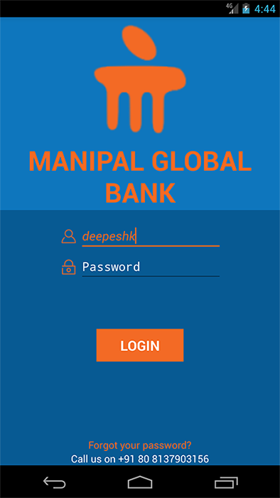
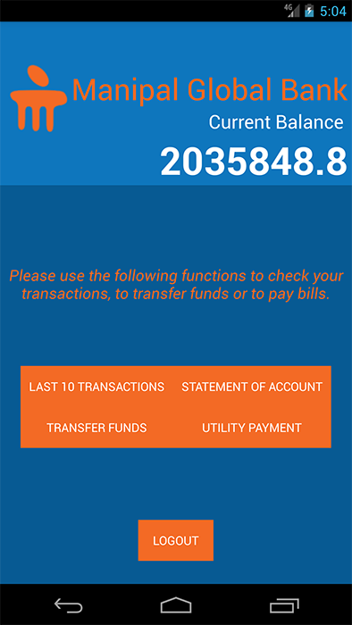
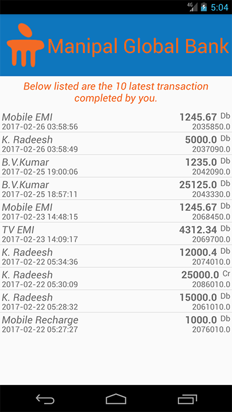
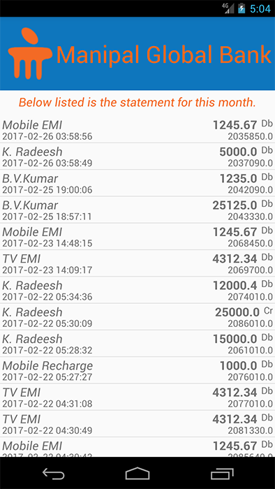
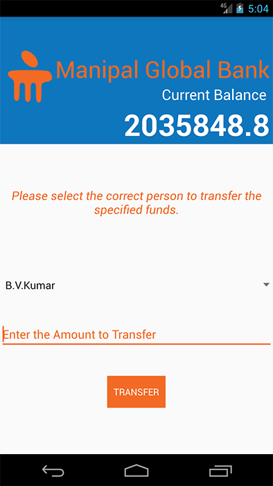
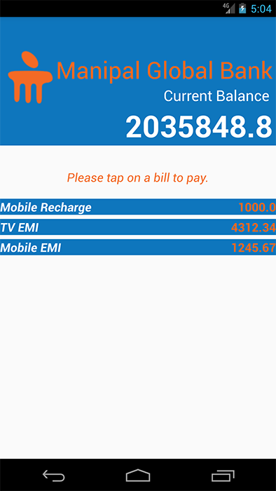

# Android Project - Manipal Global Bank

This is a project done for Manipal Global Learning - Associate Android App Developer Program (29 November 2016).

## Overview

The objective of this project is to enable the participants of the AAD program to create a small android project using the concepts and examples learned during the course of the Android Application Development training.

## Project Statement
Manipal Global Bank, MGB, is an International Banking Organization managing Savings, Current and Loan and other variety of operations for its worldwide clients. Invasion of the Internet and the rampant revolution in the usage and spread of smartphones by individuals and professionals in the world has made MGB to think of enabling their clients to do all the banking activities using their smartphones. In this direction, MGB has approached you (as an expert on Android Development Platform) to create an Android Platform based application that is capable of doing the following operations:

1. Login to the account securely
2. View Statement of Account
3. View last 10 Transactions
4. Fund Transfer to another MGB Account
5. Receive Fund Transfer from another MGB Account
6. Make Utility Payments
7. Logout Securely

## Note

* Android Studio 2.1.2 - Minimum SDK Version compiled is for Android SDK Version 17.*

# App

## Login Screen

The Login activity is the first activity we see after the app launch. You can use the following login IDs to login.

1. deepeshk
2. radeeshk
3. kumarbv

Password for all three accounts is *password*.

## Home Screen

All the functionalities the application can perform can be accessed from here. 

Pressing the BACK button from the Navigation Bar will quit the application. And upon resuming will again show the Login Screen securely. After touching the LOGOUT button and reaching the Login Screen, the BACK button in the Navigation Bar CANNOT be used to go back to Home Screen.

## Last 10 Transactions

Here the latest transactions are displayed (Limit to 10 entries).

## Statement of Account

Here the statement is displayed.

## Transfer Funds

Select the User to whom you want to transfer funds from the drop down list and tappin gthe Transfer button after entering the required amount. A dialog box appears asking you to confirm the transaction. The database is updated for both the users, which can be checked by login in as the other user and viewing their latest transactions.

## Utility Payments

By tapping a bill, you can complete the payment of that particular bill. A dialog box appears asking you to confirm the transaction.

* The bills don't disappear after transaction.*

### Note

* Using Minimum Android SDK Version 17 has restricted the use of some design themes.*
